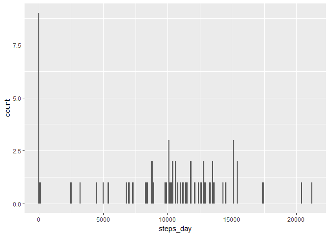
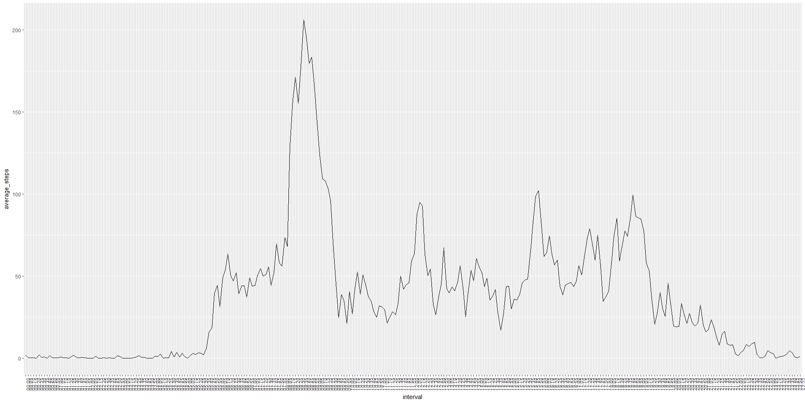
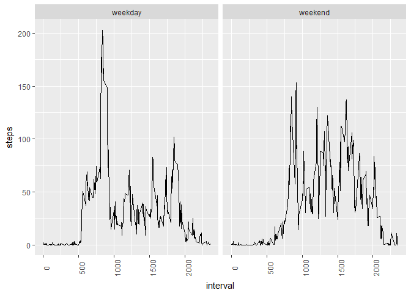

# Course Project 1
Joao Paulo de Oliveira Pereira  
July 3rd, 2017  


This is the Reproducible Research  course project 1 and it consists in the analysis of a database containing daily activity from anonymous people.

### Total number of steps per day

```r
setwd("D:/Data Science/Curso R/5. Reproducible Research/")
require(dplyr)
require(ggplot2)

activity <- read.csv("activity.csv")

steps <- group_by(activity, date) %>%
        summarise(steps_day = sum(steps, na.rm = TRUE)) %>%
        as.data.frame() %>%
        print()
```

```
##          date steps_day
## 1  2012-10-01         0
## 2  2012-10-02       126
## 3  2012-10-03     11352
## 4  2012-10-04     12116
## 5  2012-10-05     13294
## 6  2012-10-06     15420
## 7  2012-10-07     11015
## 8  2012-10-08         0
## 9  2012-10-09     12811
## 10 2012-10-10      9900
## 11 2012-10-11     10304
## 12 2012-10-12     17382
## 13 2012-10-13     12426
## 14 2012-10-14     15098
## 15 2012-10-15     10139
## 16 2012-10-16     15084
## 17 2012-10-17     13452
## 18 2012-10-18     10056
## 19 2012-10-19     11829
## 20 2012-10-20     10395
## 21 2012-10-21      8821
## 22 2012-10-22     13460
## 23 2012-10-23      8918
## 24 2012-10-24      8355
## 25 2012-10-25      2492
## 26 2012-10-26      6778
## 27 2012-10-27     10119
## 28 2012-10-28     11458
## 29 2012-10-29      5018
## 30 2012-10-30      9819
## 31 2012-10-31     15414
## 32 2012-11-01         0
## 33 2012-11-02     10600
## 34 2012-11-03     10571
## 35 2012-11-04         0
## 36 2012-11-05     10439
## 37 2012-11-06      8334
## 38 2012-11-07     12883
## 39 2012-11-08      3219
## 40 2012-11-09         0
## 41 2012-11-10         0
## 42 2012-11-11     12608
## 43 2012-11-12     10765
## 44 2012-11-13      7336
## 45 2012-11-14         0
## 46 2012-11-15        41
## 47 2012-11-16      5441
## 48 2012-11-17     14339
## 49 2012-11-18     15110
## 50 2012-11-19      8841
## 51 2012-11-20      4472
## 52 2012-11-21     12787
## 53 2012-11-22     20427
## 54 2012-11-23     21194
## 55 2012-11-24     14478
## 56 2012-11-25     11834
## 57 2012-11-26     11162
## 58 2012-11-27     13646
## 59 2012-11-28     10183
## 60 2012-11-29      7047
## 61 2012-11-30         0
```

```r
ggplot(steps) +
        geom_histogram(mapping = aes(steps_day), binwidth = 100)
```

<!-- -->

#### Mean of the total number of steps taken per day

```r
mean(steps$steps_day)
```

```
## [1] 9354.23
```

#### Median of the total number of steps taken per day

```r
median(steps$steps_day)
```

```
## [1] 10395
```

### Five minutes interval Analysis

```r
interval <- tapply(activity$steps,activity$interval, function(x) mean(x, na.rm = TRUE)) %>%
        as.data.frame() %>%
        setNames(c("average_steps")) %>%
        mutate(interval = rownames(.)) %>%
        select(-average_steps, everything()) %>%
        mutate(interval = formatC(as.numeric(interval), width = 4, flag = "0")) %>%
        mutate(interval = paste0(substring(interval,1,2),":",substring(interval,3))) 

ggplot(interval, aes(x = interval, y = average_steps, group = 1)) +
        geom_line() +
        theme(axis.text.x = element_text(angle = 90))
```

<!-- -->


```r
max <- interval[interval$average_steps == max(interval$average_steps),"interval"]
```
The five minute interval that contains the maximum number of steps across all days occurs at 08:35.

### Total number os steps per day after replacing the missing values for the average number of steps for each five minute interval 

```r
activityNA <- tapply(activity$steps, activity$interval,function(x) mean(x, na.rm = TRUE)) %>%
        as.data.frame() %>%
        setNames("avg_steps_interval") %>%
        mutate(interval = as.numeric(rownames(.))) %>%
        full_join(activity) %>%
        mutate(steps = replace(.$steps, is.na(.$steps), .$avg_steps_interval)) %>%
        select(steps, date, interval) 

stepsNA <- group_by(activityNA, date) %>%
        summarise(steps_day = sum(steps)) %>%
        as.data.frame()

ggplot(stepsNA) +
        geom_histogram(mapping = aes(steps_day), binwidth = 100)
```

<!-- -->

### Comparing the number of steps in weekends and weekdays

```r
wactivity <- activityNA %>%
        mutate(type = factor(ifelse(weekdays(as.Date(.$date)) == "sábado"|weekdays(as.Date(.$date)) == "domingo", "weekend", "weekday")))

winterval <- tapply(activityNA$steps,activityNA$interval, function(x) mean(x, na.rm = TRUE)) %>%
        as.data.frame() %>%
        setNames(c("average_steps")) %>%
        mutate(interval = rownames(.)) %>%
        select(-average_steps, everything()) %>%
        mutate(interval = formatC(as.numeric(interval), width = 4, flag = "0")) %>%
        mutate(interval = paste0(substring(interval,1,2),":",substring(interval,3))) 

ggplot(wactivity, aes(x = interval, y = steps, group = 1)) +
        stat_summary(geom = "line", fun.y = "mean") +
        theme(axis.text.x = element_text(angle = 90)) +
        facet_wrap(~type)
```

<!-- -->


